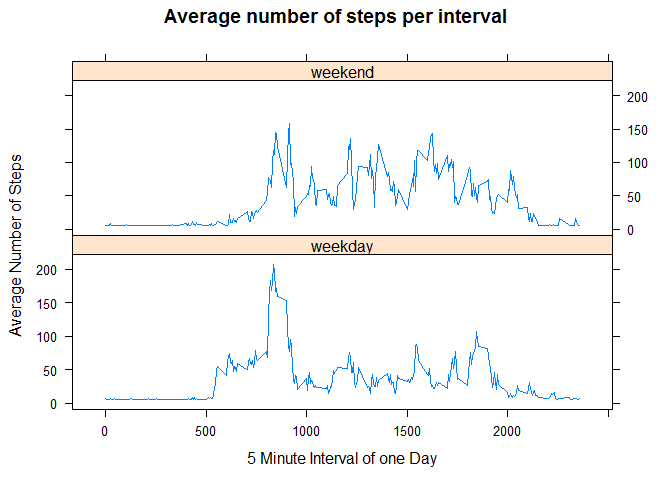

# Reproducible Research: Peer Assessment 1

## Introduction

This is the course assignment for week 2 of the Coursera course Reproducible Research. The data set at hand describes activity data. For more information see the readme in the GitHub folder. In this assignment it is the goal to read a dataset, create charts for it to visualize the data, impute missing values and finally compare activity of weekdays and weekends.

The following libraries are used: stringr, plyr and lattice.


## Loading and preprocessing the data

In this section the data is loaded as is. A reconciliation is done to check the number of rows that have been loaded. Further, the date is converted from string to a date format and combined with the interval to get a datetime.


```r
library(stringr)
library(plyr)
# Load data set, do not do any conversions
dataRaw <- read.csv("activity.csv", sep = ",", header = TRUE, as.is = TRUE )

# check format of data
str(dataRaw)
```

```
## 'data.frame':	17568 obs. of  3 variables:
##  $ steps   : int  NA NA NA NA NA NA NA NA NA NA ...
##  $ date    : chr  "2012-10-01" "2012-10-01" "2012-10-01" "2012-10-01" ...
##  $ interval: int  0 5 10 15 20 25 30 35 40 45 ...
```

```r
# number of rows
nrow(dataRaw) # 17568, ok same as in Coursera documentation
```

```
## [1] 17568
```

```r
# convert date (chr) and interval (int) columns datetime using strptime. Format of date appears to be YYYY-MM-DD
# pad the interval into a HHMM format
dataRaw$datetime <- strptime(paste(dataRaw$date,str_pad(dataRaw$interval, width=4, side="left", pad="0")), "%Y-%m-%d %H%M")
```


## What is mean total number of steps taken per day?

Calculate the total number of steps taken per day and show this as a histogram. Further, the mean and median number of steps taken per day should be reported.


```r
# Get the total number of steps per day using a function from plyr package
stepsDay <- ddply(dataRaw,.(date),
      summarize,
      averageSteps=mean(steps, na.rm=TRUE),
      sumSteps=sum(steps),
      medianSteps=median(steps, na.rm=TRUE)
)

# plot as histogram
hist(stepsDay$sumSteps, xlab="Total Number of Steps per Day", main="Histogram of the total number of steps taken each day")
```

<!-- -->

```r
# Report mean and median number of steps taken per day

# median: previously created stepsDay result for this
paste(stepsDay$date, stepsDay$medianSteps)
```

```
##  [1] "2012-10-01 NA" "2012-10-02 0"  "2012-10-03 0"  "2012-10-04 0" 
##  [5] "2012-10-05 0"  "2012-10-06 0"  "2012-10-07 0"  "2012-10-08 NA"
##  [9] "2012-10-09 0"  "2012-10-10 0"  "2012-10-11 0"  "2012-10-12 0" 
## [13] "2012-10-13 0"  "2012-10-14 0"  "2012-10-15 0"  "2012-10-16 0" 
## [17] "2012-10-17 0"  "2012-10-18 0"  "2012-10-19 0"  "2012-10-20 0" 
## [21] "2012-10-21 0"  "2012-10-22 0"  "2012-10-23 0"  "2012-10-24 0" 
## [25] "2012-10-25 0"  "2012-10-26 0"  "2012-10-27 0"  "2012-10-28 0" 
## [29] "2012-10-29 0"  "2012-10-30 0"  "2012-10-31 0"  "2012-11-01 NA"
## [33] "2012-11-02 0"  "2012-11-03 0"  "2012-11-04 NA" "2012-11-05 0" 
## [37] "2012-11-06 0"  "2012-11-07 0"  "2012-11-08 0"  "2012-11-09 NA"
## [41] "2012-11-10 NA" "2012-11-11 0"  "2012-11-12 0"  "2012-11-13 0" 
## [45] "2012-11-14 NA" "2012-11-15 0"  "2012-11-16 0"  "2012-11-17 0" 
## [49] "2012-11-18 0"  "2012-11-19 0"  "2012-11-20 0"  "2012-11-21 0" 
## [53] "2012-11-22 0"  "2012-11-23 0"  "2012-11-24 0"  "2012-11-25 0" 
## [57] "2012-11-26 0"  "2012-11-27 0"  "2012-11-28 0"  "2012-11-29 0" 
## [61] "2012-11-30 NA"
```

```r
# mean: previously created stepsDay result for this
paste(stepsDay$date, stepsDay$average)
```

```
##  [1] "2012-10-01 NaN"               "2012-10-02 0.4375"           
##  [3] "2012-10-03 39.4166666666667"  "2012-10-04 42.0694444444444" 
##  [5] "2012-10-05 46.1597222222222"  "2012-10-06 53.5416666666667" 
##  [7] "2012-10-07 38.2465277777778"  "2012-10-08 NaN"              
##  [9] "2012-10-09 44.4826388888889"  "2012-10-10 34.375"           
## [11] "2012-10-11 35.7777777777778"  "2012-10-12 60.3541666666667" 
## [13] "2012-10-13 43.1458333333333"  "2012-10-14 52.4236111111111" 
## [15] "2012-10-15 35.2048611111111"  "2012-10-16 52.375"           
## [17] "2012-10-17 46.7083333333333"  "2012-10-18 34.9166666666667" 
## [19] "2012-10-19 41.0729166666667"  "2012-10-20 36.09375"         
## [21] "2012-10-21 30.6284722222222"  "2012-10-22 46.7361111111111" 
## [23] "2012-10-23 30.9652777777778"  "2012-10-24 29.0104166666667" 
## [25] "2012-10-25 8.65277777777778"  "2012-10-26 23.5347222222222" 
## [27] "2012-10-27 35.1354166666667"  "2012-10-28 39.7847222222222" 
## [29] "2012-10-29 17.4236111111111"  "2012-10-30 34.09375"         
## [31] "2012-10-31 53.5208333333333"  "2012-11-01 NaN"              
## [33] "2012-11-02 36.8055555555556"  "2012-11-03 36.7048611111111" 
## [35] "2012-11-04 NaN"               "2012-11-05 36.2465277777778" 
## [37] "2012-11-06 28.9375"           "2012-11-07 44.7326388888889" 
## [39] "2012-11-08 11.1770833333333"  "2012-11-09 NaN"              
## [41] "2012-11-10 NaN"               "2012-11-11 43.7777777777778" 
## [43] "2012-11-12 37.3784722222222"  "2012-11-13 25.4722222222222" 
## [45] "2012-11-14 NaN"               "2012-11-15 0.142361111111111"
## [47] "2012-11-16 18.8923611111111"  "2012-11-17 49.7881944444444" 
## [49] "2012-11-18 52.4652777777778"  "2012-11-19 30.6979166666667" 
## [51] "2012-11-20 15.5277777777778"  "2012-11-21 44.3993055555556" 
## [53] "2012-11-22 70.9270833333333"  "2012-11-23 73.5902777777778" 
## [55] "2012-11-24 50.2708333333333"  "2012-11-25 41.0902777777778" 
## [57] "2012-11-26 38.7569444444444"  "2012-11-27 47.3819444444444" 
## [59] "2012-11-28 35.3576388888889"  "2012-11-29 24.46875"         
## [61] "2012-11-30 NaN"
```

## What is the average daily activity pattern?

* Make a time series plot of the 5-minute interval (x-axis) and the average number of steps taken, averaged across all days (y-axis)
* Which 5-minute interval, on average across all the days in the dataset, contains the maximum number of steps?


```r
library(lattice)
```

```
## Warning: package 'lattice' was built under R version 3.3.3
```

```r
interval1 <- ddply(dataRaw,.(interval),
      summarize,
      meanSteps=mean(steps, na.rm = T)
)

# plot as time series
xyplot(interval1$meanSteps ~ interval1$interval, type="l", xlab="5 Minute Interval of one Day", ylab="Average Number of Steps", main = "Average number of steps per interval")
```

<!-- -->

```r
# determine the interval that contains the max average number of steps
interval1[which.max(interval1$meanSteps),]
```

```
##     interval meanSteps
## 104      835  206.1698
```

```r
# Interval 835 has the highest number of mean steps
```

Interval 835 has the highest number of mean steps

## Imputing missing values

* Calculate and report the total number of missing values in the dataset (i.e. the total number of rows with NA)
* Devise a strategy for filling in all of the missing values in the dataset. The strategy does not need to be sophisticated. For example, you could use the mean or median for that day, or the mean for that 5-minute interval, etc.
* Create a new dataset that is equal to the original dataset but with the missing data filled in.
* Make a histogram of the total number of steps taken each day and Calculate and report the mean and median total number of steps taken per day. Do these values differ from the estimates from the first part of the assignment? What is the impact of imputing missing data on the estimates of the total daily number of steps?


```r
# output the number of rows which have null values
nrow(dataRaw[is.na(dataRaw$steps),]) 
```

```
## [1] 2304
```

```r
# 2304 rows have null values

# determine the mean for a day, e.g. monday, tuesday
head(dataRaw)
```

```
##   steps       date interval            datetime
## 1    NA 2012-10-01        0 2012-10-01 00:00:00
## 2    NA 2012-10-01        5 2012-10-01 00:05:00
## 3    NA 2012-10-01       10 2012-10-01 00:10:00
## 4    NA 2012-10-01       15 2012-10-01 00:15:00
## 5    NA 2012-10-01       20 2012-10-01 00:20:00
## 6    NA 2012-10-01       25 2012-10-01 00:25:00
```

```r
# use $wday component of POSIXlt to return weekday. 
dataRaw$day <- dataRaw$datetime$wday

# subset dataRaw to only include rows that are not NA and another for rows that contain NA
dataRawNonNull <- na.omit(dataRaw)
dataRawNull <- dataRaw[rowSums(is.na(dataRaw)) > 0,]

# use the aggregate function to calculate the mean per day of the week
mean.day <- aggregate(dataRawNonNull$steps, by=list(dataRawNonNull$day), mean)

# rename the columns
names(mean.day) <- c("day","mean")

# impute the actual NAs
dataRawNullFixed <- merge(x = dataRawNull, y=mean.day, all.x = TRUE)

# reorder the data frame to match the original
dataRawNullFixed$steps <- dataRawNullFixed$mean

# drop the means colum
dataRawNullFixed$mean <- NULL

# join the 2 dataframes to create the ouput

dataProcessed <- rbind(dataRawNullFixed, dataRawNonNull)

# plot a histogram for the total number of steps taken per day and report mean/median
# first create statistics
stepsDay2 <- ddply(dataProcessed,.(date),
      summarize,
      averageSteps=mean(steps, na.rm=TRUE),
      sumSteps=sum(steps),
      medianSteps=median(steps, na.rm=TRUE)
)

# plot as histogram
hist(stepsDay2$sumSteps, xlab="Total Number of Steps per Day", main="Histogram of the total number of steps taken each day")
```

<!-- -->

```r
# Report mean and median number of steps taken per day

# Report old and new median: 
paste(stepsDay2$date, stepsDay$medianSteps, stepsDay2$medianSteps)
```

```
##  [1] "2012-10-01 NA 34.6349206349206" "2012-10-02 0 0"                
##  [3] "2012-10-03 0 0"                 "2012-10-04 0 0"                
##  [5] "2012-10-05 0 0"                 "2012-10-06 0 0"                
##  [7] "2012-10-07 0 0"                 "2012-10-08 NA 34.6349206349206"
##  [9] "2012-10-09 0 0"                 "2012-10-10 0 0"                
## [11] "2012-10-11 0 0"                 "2012-10-12 0 0"                
## [13] "2012-10-13 0 0"                 "2012-10-14 0 0"                
## [15] "2012-10-15 0 0"                 "2012-10-16 0 0"                
## [17] "2012-10-17 0 0"                 "2012-10-18 0 0"                
## [19] "2012-10-19 0 0"                 "2012-10-20 0 0"                
## [21] "2012-10-21 0 0"                 "2012-10-22 0 0"                
## [23] "2012-10-23 0 0"                 "2012-10-24 0 0"                
## [25] "2012-10-25 0 0"                 "2012-10-26 0 0"                
## [27] "2012-10-27 0 0"                 "2012-10-28 0 0"                
## [29] "2012-10-29 0 0"                 "2012-10-30 0 0"                
## [31] "2012-10-31 0 0"                 "2012-11-01 NA 28.5164930555556"
## [33] "2012-11-02 0 0"                 "2012-11-03 0 0"                
## [35] "2012-11-04 NA 42.6309523809524" "2012-11-05 0 0"                
## [37] "2012-11-06 0 0"                 "2012-11-07 0 0"                
## [39] "2012-11-08 0 0"                 "2012-11-09 NA 42.9156746031746"
## [41] "2012-11-10 NA 43.5257936507937" "2012-11-11 0 0"                
## [43] "2012-11-12 0 0"                 "2012-11-13 0 0"                
## [45] "2012-11-14 NA 40.9401041666667" "2012-11-15 0 0"                
## [47] "2012-11-16 0 0"                 "2012-11-17 0 0"                
## [49] "2012-11-18 0 0"                 "2012-11-19 0 0"                
## [51] "2012-11-20 0 0"                 "2012-11-21 0 0"                
## [53] "2012-11-22 0 0"                 "2012-11-23 0 0"                
## [55] "2012-11-24 0 0"                 "2012-11-25 0 0"                
## [57] "2012-11-26 0 0"                 "2012-11-27 0 0"                
## [59] "2012-11-28 0 0"                 "2012-11-29 0 0"                
## [61] "2012-11-30 NA 42.9156746031746"
```

```r
# Report old and new mean
paste(stepsDay2$date, stepsDay$average, stepsDay2$average)
```

```
##  [1] "2012-10-01 NaN 34.6349206349206"               
##  [2] "2012-10-02 0.4375 0.4375"                      
##  [3] "2012-10-03 39.4166666666667 39.4166666666667"  
##  [4] "2012-10-04 42.0694444444444 42.0694444444444"  
##  [5] "2012-10-05 46.1597222222222 46.1597222222222"  
##  [6] "2012-10-06 53.5416666666667 53.5416666666667"  
##  [7] "2012-10-07 38.2465277777778 38.2465277777778"  
##  [8] "2012-10-08 NaN 34.6349206349206"               
##  [9] "2012-10-09 44.4826388888889 44.4826388888889"  
## [10] "2012-10-10 34.375 34.375"                      
## [11] "2012-10-11 35.7777777777778 35.7777777777778"  
## [12] "2012-10-12 60.3541666666667 60.3541666666667"  
## [13] "2012-10-13 43.1458333333333 43.1458333333333"  
## [14] "2012-10-14 52.4236111111111 52.4236111111111"  
## [15] "2012-10-15 35.2048611111111 35.2048611111111"  
## [16] "2012-10-16 52.375 52.375"                      
## [17] "2012-10-17 46.7083333333333 46.7083333333333"  
## [18] "2012-10-18 34.9166666666667 34.9166666666667"  
## [19] "2012-10-19 41.0729166666667 41.0729166666667"  
## [20] "2012-10-20 36.09375 36.09375"                  
## [21] "2012-10-21 30.6284722222222 30.6284722222222"  
## [22] "2012-10-22 46.7361111111111 46.7361111111111"  
## [23] "2012-10-23 30.9652777777778 30.9652777777778"  
## [24] "2012-10-24 29.0104166666667 29.0104166666667"  
## [25] "2012-10-25 8.65277777777778 8.65277777777778"  
## [26] "2012-10-26 23.5347222222222 23.5347222222222"  
## [27] "2012-10-27 35.1354166666667 35.1354166666667"  
## [28] "2012-10-28 39.7847222222222 39.7847222222222"  
## [29] "2012-10-29 17.4236111111111 17.4236111111111"  
## [30] "2012-10-30 34.09375 34.09375"                  
## [31] "2012-10-31 53.5208333333333 53.5208333333333"  
## [32] "2012-11-01 NaN 28.5164930555556"               
## [33] "2012-11-02 36.8055555555556 36.8055555555556"  
## [34] "2012-11-03 36.7048611111111 36.7048611111111"  
## [35] "2012-11-04 NaN 42.6309523809524"               
## [36] "2012-11-05 36.2465277777778 36.2465277777778"  
## [37] "2012-11-06 28.9375 28.9375"                    
## [38] "2012-11-07 44.7326388888889 44.7326388888889"  
## [39] "2012-11-08 11.1770833333333 11.1770833333333"  
## [40] "2012-11-09 NaN 42.9156746031746"               
## [41] "2012-11-10 NaN 43.5257936507937"               
## [42] "2012-11-11 43.7777777777778 43.7777777777778"  
## [43] "2012-11-12 37.3784722222222 37.3784722222222"  
## [44] "2012-11-13 25.4722222222222 25.4722222222222"  
## [45] "2012-11-14 NaN 40.9401041666667"               
## [46] "2012-11-15 0.142361111111111 0.142361111111111"
## [47] "2012-11-16 18.8923611111111 18.8923611111111"  
## [48] "2012-11-17 49.7881944444444 49.7881944444444"  
## [49] "2012-11-18 52.4652777777778 52.4652777777778"  
## [50] "2012-11-19 30.6979166666667 30.6979166666667"  
## [51] "2012-11-20 15.5277777777778 15.5277777777778"  
## [52] "2012-11-21 44.3993055555556 44.3993055555556"  
## [53] "2012-11-22 70.9270833333333 70.9270833333333"  
## [54] "2012-11-23 73.5902777777778 73.5902777777778"  
## [55] "2012-11-24 50.2708333333333 50.2708333333333"  
## [56] "2012-11-25 41.0902777777778 41.0902777777778"  
## [57] "2012-11-26 38.7569444444444 38.7569444444444"  
## [58] "2012-11-27 47.3819444444444 47.3819444444444"  
## [59] "2012-11-28 35.3576388888889 35.3576388888889"  
## [60] "2012-11-29 24.46875 24.46875"                  
## [61] "2012-11-30 NaN 42.9156746031746"
```

Most frequent value before imputation was 0 for every day. Due to the imputation, NULL values were changed to the average of the day and this results in a change of the median values. For the calculation of the mean there is only a change for days that previously had NULL values. 

It is recommend to revise the imputation of NULL values in a real life scenario. Never the less, due to the imputation of missing values it is possible to add more detail.

## Are there differences in activity patterns between weekdays and weekends?


```r
# first create a factor variable to distinguish between weekend and work days
# the day column can be used as input for this. 0 and 6 are saturday/sunday

dataProcessed$dataType <- ifelse(dataProcessed$day %in% c(0,6),"weekend","weekday")
dataProcessed$dataType <- as.factor(dataProcessed$dataType)

# check that the created variable is a factor
str(dataProcessed)
```

```
## 'data.frame':	17568 obs. of  6 variables:
##  $ day     : int  0 0 0 0 0 0 0 0 0 0 ...
##  $ steps   : num  42.6 42.6 42.6 42.6 42.6 ...
##  $ date    : chr  "2012-11-04" "2012-11-04" "2012-11-04" "2012-11-04" ...
##  $ interval: int  0 5 10 15 20 25 30 35 40 45 ...
##  $ datetime: POSIXlt, format: "2012-11-04 00:00:00" "2012-11-04 00:05:00" ...
##  $ dataType: Factor w/ 2 levels "weekday","weekend": 2 2 2 2 2 2 2 2 2 2 ...
```

```r
# ok

# Aggregate the data by interval, i.e. get the average per interval
interval <- ddply(dataProcessed,.(interval,dataType),
      summarize,
      meanSteps=mean(steps)
)

# create plot using lattice
#dataProcessed$interval <- as.numeric(dataProcessed$interval)
xyplot(interval$meanSteps ~ interval$interval|interval$dataType, type="l", layout=c(1,2), xlab="5 Minute Interval of one Day", ylab="Average Number of Steps", main = "Average number of steps per interval")
```

<!-- -->

